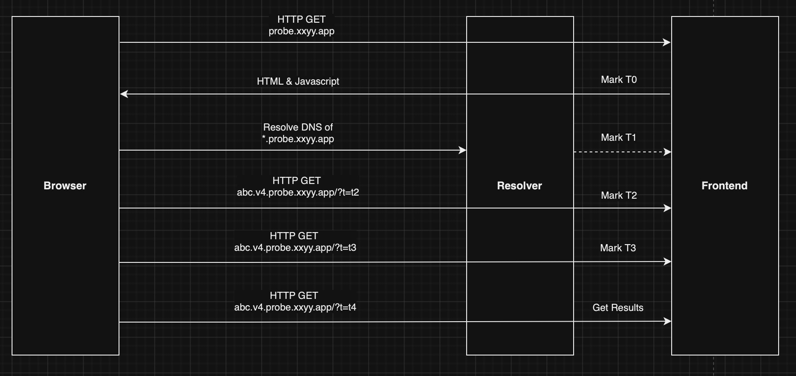

# Description
A dns probing tool which shows your DNS resolver IPs and latancy.

It can also test if your browser supports HTTP3 and show your IP addresses.

See the architecture image below for technical details.

# Deploy
To deploy this project, you need to:
1) Register a domain;
2) Run `dns_probe_frontend` on a server machine, listening for DNS probing requests;
3) Setup your own authoritative DNS servers for your domain. Change your DNS servers' binding port to some port other than 53(553 for example). Run the `dns_probe_resolver` tool, which will forward requests to your real DNS servers, and send probe to your `dns_probe_frontend` server;

# Demo
See the demo here: [https://probe.xxyy.app/](https://probe.xxyy.app/)

# Architecture


```
T1 - T0 =  HTTP_Downward_Time + Browser_DNS_Delay

T2 - T1 =  DNS_Downward_Time + HTTP_Upward_Time

T3 - T2 =  HTTP_Downward_Time + HTTP_Upward_Time

Where

Browser_DNS_Delay is the time between browser starts loading and DNS resolver receives request.

DNS_Downward_Time is the time between DNS resolver responds and Browser gets the response.

Both account for DNS overhead.


Browser_DNS_Delay + DNS_Downward_Time = (T2 - T0) - (T3 - T2)

if assume HTTP_Downward_Time = HTTP_Upward_Time, then

  Browser_DNS_Delay = ( T1 - T0) - (T3 - T2)/2

  DNS_Downward_Time = ( T2 - T1) - (T3 - T2)/2
```
